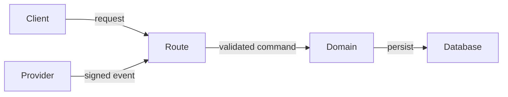
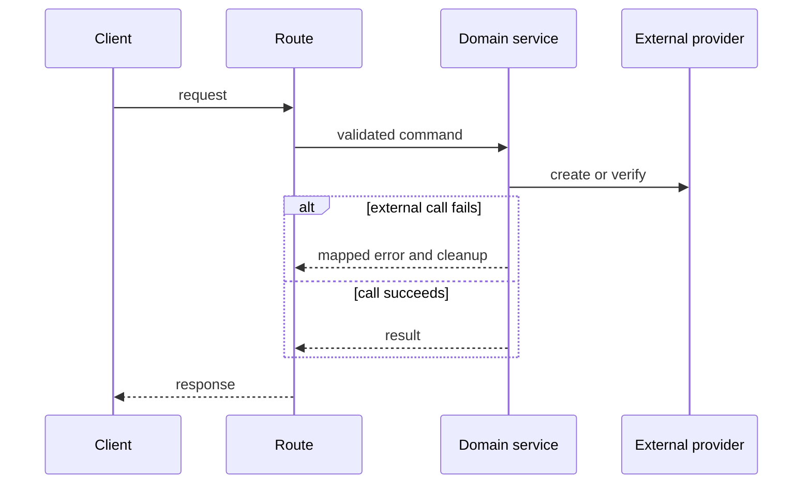
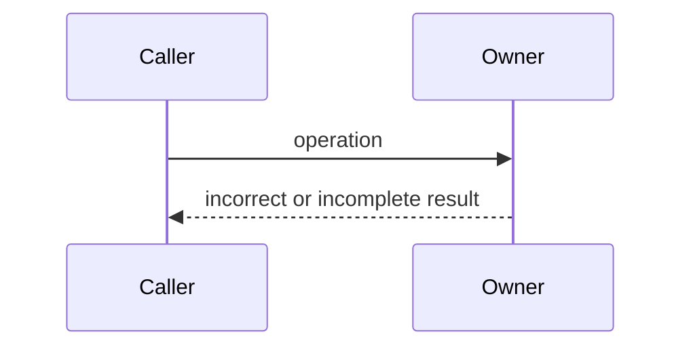
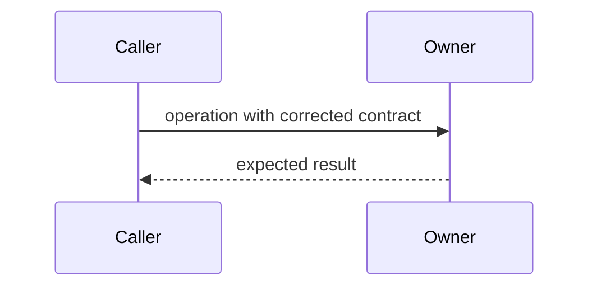

# Pull Request Body Template

Use this template as a decision guide. Keep `Summary` and `Verification`. Add other sections only when they improve the review. Do not invent content to fill a section.

## Summary

State the problem or capability first. Then state the result and the reason for this approach.

- What user or system behavior changed?
- Why does this change belong in this PR?
- Is this PR independent or stacked?

For a stacked PR, name the parent PR or branch. Separate inherited changes from this PR's own changes.

## Change map

Use this section when the diff changes several modules, responsibilities, or ownership boundaries. Do not paste the changed-file list.

| Module | Before | After | Description |
| --- | --- | --- | --- |
| `<module or boundary>` | `<previous responsibility or behavior>` | `<new responsibility or behavior>` | `<reason and effect>` |

Add a small responsibility tree only when it makes the scope easier to understand:

```text
server/
├── routes/             # Accept and validate the protocol input
├── services/domain/    # Own the business invariant
└── services/adapters/  # Connect the domain to an external system
```

## Architecture and behavior

### Module flow

Use this diagram for a cross-module feature or boundary change:



### Behavior flow

Use this diagram when the change has observable ordering, asynchronous work, events, IPC, or cleanup:



Use a state diagram instead when transitions or terminal states explain the change better. Name the correlation key and idempotency rule when they apply.

### Before and After for a fix

Use a pair when structure, ordering, lifecycle, or state explains the fault. Keep both diagrams structurally comparable.

#### Before



#### After



After the pair, describe the exact changed edge, step, owner, or transition. Do not make the reader infer the difference.

If reviewers can reasonably expect a diagram, but one does not apply, use this form:

> Not applicable: this change only updates `<documentation, constant, or local name>` and does not change runtime flow.

## Boundaries and risks

Use this section when the change has meaningful failure modes, invariants, migrations, or external effects. Include only relevant risks.

| Invariant or boundary | Failure mode | Protection | Evidence or gap |
| --- | --- | --- | --- |
| `<required behavior>` | `<duplicate, timeout, race, invalid input, or other failure>` | `<guard, ownership rule, transaction, or cleanup>` | `<test, runtime evidence, or unverified gap>` |

Consider these risk groups:

- Input validation, authorization, public contracts, and defaults.
- Failure mapping, retries, duplicate events, concurrency, cancellation, ordering, and cleanup.
- Transactions, schema changes, backfills, deployment order, and rollback.
- Provider signatures, resource ownership, callback delivery, queues, and asynchronous completion.
- Identity boundaries, cross-user access, secret handling, logs, metrics, and error payloads.
- Loading, error, empty, stale, offline, navigation, and repeated-action UI states.
- Cross-window state ownership, serialization, watcher effects, and persistence ownership.

Mark missing evidence as `Not verified`. Do not convert a risk question into a claim.

## Verification

List exact commands and their results. Map important evidence to the behavior or invariant that it demonstrates.

```text
pnpm exec vitest run <path>
pnpm -F <workspace> typecheck
pnpm lint
```

Keep these evidence types separate:

- Focused tests prove the covered behavior.
- Typecheck and lint prove static checks.
- CI proves only its configured checks.
- Runtime checks prove only the inspected environment and state.
- Manual acceptance proves only the completed scenario.

List each unverified item. Do not omit it because another check passed.

## Visual changes

Use this section for user-visible UI changes. Follow the visual workflow in the main skill before you add this table.

| Before | After |
| --- | --- |
|  |  |
| `<page, component, state, viewport, theme>` | `<page, component, state, viewport, theme>` |

Use `Absent` for a new UI state. Use `Removed` for a deleted UI state.

## Rollout and follow-up

Add this optional section for migrations, feature gates, staged rollout, monitoring, known gaps, or a required follow-up PR.

Do not hide incomplete work in this section. State whether the gap blocks merge or belongs to a separate task.
