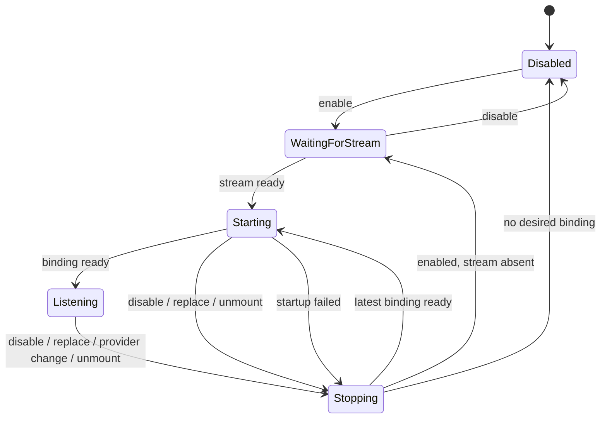
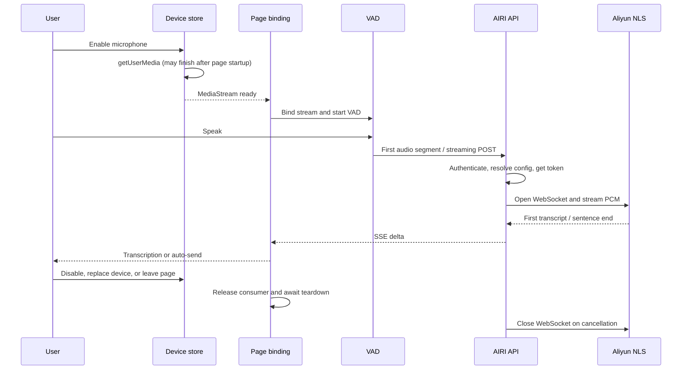

# Voice input binding follows the microphone stream

Status: Proposed

## Context

The Web and Pocket home pages used to start voice input when the saved
`enabled` setting changed. Device discovery and `getUserMedia` can finish later.
The pages then started their own VAD on the late stream but did not bind the
streaming ASR pipeline. A later toggle, device change, or unmount could also
overlap an earlier asynchronous start or stop.

In an Edge reproduction on 2026-09-23, the microphone control remained enabled
after two spoken phrases, but the Network panel showed no transcription request
and the Console showed no Hearing Pipeline startup message. The same absence
remained after an off/on toggle. A refresh restored the enabled control without
a startup message. This is a client-side startup failure, not an upstream latency
measurement.

## Decision

- A page binds voice input only when it has both `enabled` and a `MediaStream`.
- A binding identifies the stream object and the provider mode. Changes are
  serialized: release the old binding, then start the latest requested one.
- Streaming providers use the Hearing pipeline's VAD. Recorder-backed providers
  use the page VAD. Do not run both detectors for the same stream.
- Each streaming consumer releases only its own callbacks. The shared provider
  session stops when the last consumer leaves.
- The pipeline serializes provider binding and teardown. A replacement stream
  creates a new VAD session, even when the provider ID is unchanged.
- An aborted session cannot deliver late transcript callbacks to a new binding.
- ASR response cancellation closes the server's upstream WebSocket and stops
  reading the request audio.

## State model

`Starting → Stopping` waits for the in-flight start before releasing its partial
resources. A queued older start is skipped when a newer request supersedes it.

## Streaming ASR topology

The browser-to-AIRI leg already uploads audio incrementally and receives SSE.
Changing only that leg to WebSocket does not remove the AIRI-to-Aliyun hop.
The current ASR route does not write a per-user usage ledger; the separate TTS
WebSocket route performs a balance preflight and bills its session at completion.

## Sequence and timing points

Measure microphone-ready, VAD speech start, request start, token completion,
upstream WebSocket open, first transcript, and UI delivery separately. A missing
request must be reported as a startup failure rather than assigned an upstream
latency. No upstream timing can be inferred from the Edge reproduction above.

## Consequences

The page no longer starts a redundant VAD for streaming providers. Rapid
toggles and stream replacements may wait for the previous binding to stop, but
cannot reuse its stale stream or let its teardown close the new binding.
Direct-to-provider audio transport and its billing protocol remain separate
decisions.
