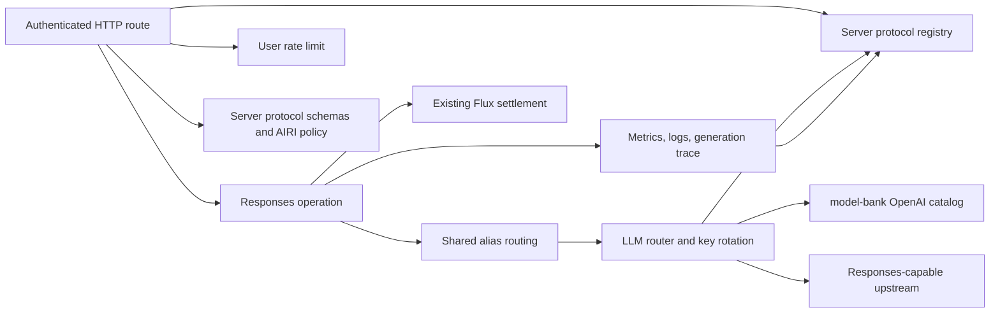
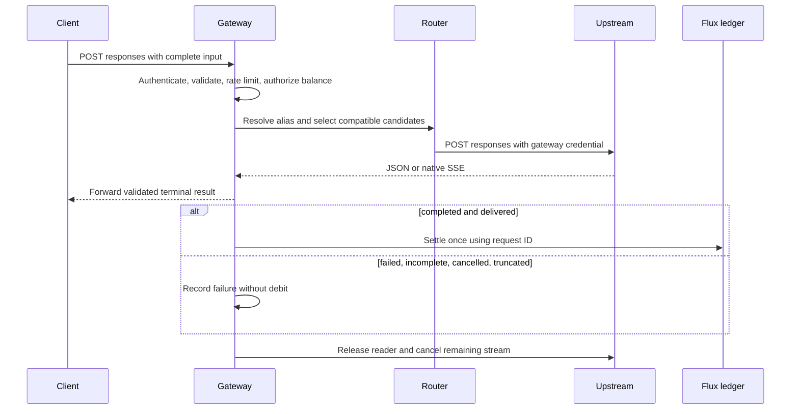

# Hosted Responses gateway

Status: accepted

## Decision and scope

The user confirmed this implementation scope and the existing `@xsai/shared-stream` parser.

Issue #2479 defines an authenticated, stateless Responses create endpoint.
This PR implements its server boundary on top of the existing gateway and Flux policy.
The client sends complete input Items. The gateway forces `store: false`.
It rejects conversation references, file IDs, background execution, and hosted tools other than web search.
After authentication, the Responses endpoint accepts a 40 MiB request body so one maximum-size inline file fits with its JSON envelope.
Other API routes keep the 1 MiB default. Larger requests must use remote URLs or smaller payloads.
The user confirmed native web search support for OpenAI upstreams.
The server reuses `model-bank/openai` search capabilities for direct OpenAI upstreams.
The canonical OpenRouter endpoint uses its Responses server tool and maps the provider-neutral tool name at the adapter boundary.
Other compatible endpoints do not advertise this provider capability.
Requests opt into search through `tools`; the gateway does not inject tools.
Search calls and sources remain portable input Items. Unsupported search candidates are skipped.

Function tools run on the client and return their output on the next request.
Each function tool must include an object parameter schema. Its `required` entries must name declared properties.
Tool choices may reference only tools declared in the same request. An `allowed_tools` choice contains at most 128 references.

Each upstream explicitly opts into Responses through `protocols: ['responses']`.
An omitted list supports Chat Completions only. This preserves the current configured service contract.
Aliases keep their primary and fallback order. Compatibility filtering precedes weighted selection so unsupported routes do not skew traffic.
Unsupported candidates never receive a request. The last attempted HTTP error remains available to the caller.
This retention applies only when a later candidate lacks protocol or search support.
Other routing errors replace an earlier HTTP response.

This change preserves the existing Flux policy and adds no per-search rate.
The service absorbs upstream search-call fees; returned search content tokens use the existing token rate.

Each request owns one billing ID. Completed results use input/output token usage and the existing Flux pricing policy.
Missing usage follows the existing flat-rate policy. Failed, incomplete, cancelled, and truncated streams incur no debit.
A streaming result becomes billable only after a validated terminal event reaches the downstream writer.
JSON results settle after body validation and before the HTTP response returns.
Cancellation before that point wins. A duplicate terminal event cannot charge again.
The gateway stops reading after the terminal event and releases upstream resources.
Metrics, request logs, and generation traces record terminal failures as well as successful requests.

OpenRouter may label Responses SSE frames with a generic or mismatched `event` name.
For this provider only, the gateway validates the JSON payload and forwards the payload `type` as the event name.
Payload types containing carriage returns or line feeds are invalid and cannot become SSE fields.
Other providers retain strict event-name matching.
OpenRouter may also omit the terminal event after every declared output item completes in order.
The gateway then synthesizes `response.completed` from the validated response and completed items.
Only the forwarded terminal result authorizes billing; malformed, incomplete, or ambiguous streams remain unbilled.

No production configuration, deployment, database migration, or default client protocol change belongs to this PR.
The official provider switch and live Flux acceptance remain release tasks under #2479.
No new rate, billing reservation, realtime session, or search service is introduced.

## Protocol ownership

The user confirmed a server-only protocol consolidation. Client protocol values remain unchanged.
A server protocol registry owns identifiers and HTTP create paths. Operation names derive as `<protocol>.create`.
Config validation, gateway operation keys, routing, and tracing consume that registry.
Each protocol adapter owns request serialization, authentication, and native search eligibility.
The gateway retains protocol-specific response lifecycles and shared billing and telemetry boundaries.
Adding a protocol requires an adapter and gateway input contract; unsupported values never select Chat implicitly.
Messages API is not implemented or advertised by this change.

The user requested alignment with xsai's existing package boundaries.
Its generation packages export TypeScript contracts, not complete wire-request validators.
`xsschema` validates caller-supplied schemas; it does not own provider request contracts.
The server therefore owns reusable Valibot schemas in `services/adapters/llm/schemas`.
Generated OpenResponses definitions and OpenAI extensions stay separate from AIRI's shared-account restrictions.
No schema export or Valibot peer is added to xsai. The pre-existing client patch remains unchanged.

## Module dependencies



## Affected files

```text
server/
  apps/api/
    README.md
    package.json
    src/{app.ts,app.test.ts}
    src/middlewares/rate-limit.ts
    src/routes/openai/v1/
      index.ts, gateway.ts, model-routing.ts, route.test.ts
      middlewares/{telemetry.ts,telemetry.test.ts}
      operations/chat-completions/index.ts
      operations/responses/{index.ts,request.ts,request.test.ts}
    src/services/
      adapters/config-kv/definitions.ts
      domain/llm-router/{router.ts,types.ts,tests/router.test.ts}
      domain/llm-tracing/{index.ts,index.test.ts}
      adapters/llm/{index.ts,chat-completions.ts,responses.ts,types.ts}
      adapters/llm/schemas/{responses.ts,openresponses-schema.ts,request-openapi.json,README.md}
    src/schemas/{generation-protocol.ts,generation-protocol.test.ts}
  docs/ai/adr/2026-09-15-hosted-responses.md
```

## Request lifecycle



## Verification

Exercise the mounted route with authentication, malformed input, stateful references, search tools, rejected hosted tools, and insufficient Flux.
Cover catalog model matching, compatible-proxy rejection, grouped fallback, portable search Items, citations, and unchanged tool choice.
Cover JSON/SSE completion, usage, upstream errors, split UTF-8 frames, cancellation, duplicate terminal events, and stream EOF.
Verify OpenRouter event-name normalization, line-break rejection, ordered EOF recovery, and settlement only after the normalized or synthesized terminal frame is delivered.
Verify grouped and ungrouped routing, incompatible candidates, key failover, and preservation of terminal upstream errors.
Run focused gateway, router, schema, and billing tests. CI checks the complete repository.

## References

- [Server scope, Issue #2479](https://github.com/moeru-ai/airi/issues/2479)
- [OpenAI Responses streaming events](https://platform.openai.com/docs/api-reference/responses-streaming)
- [Merged client adapter, PR #2477](https://github.com/moeru-ai/airi/pull/2477)
