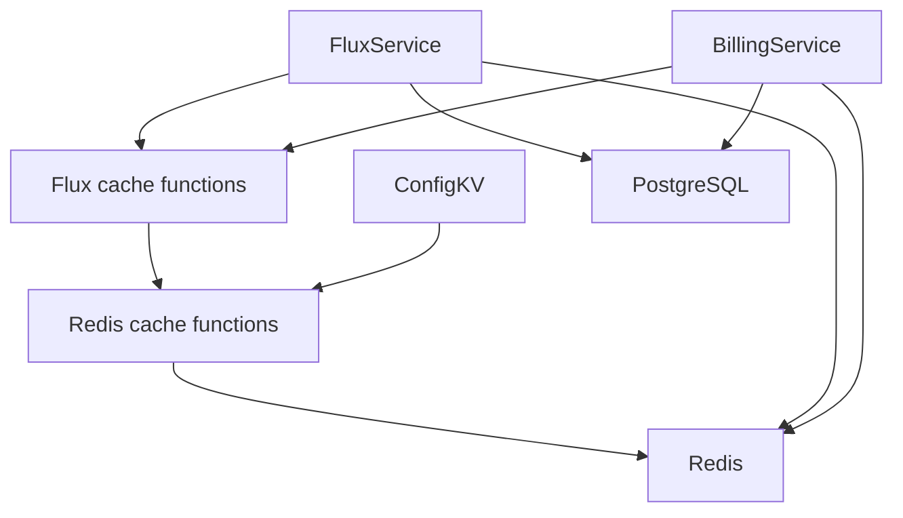
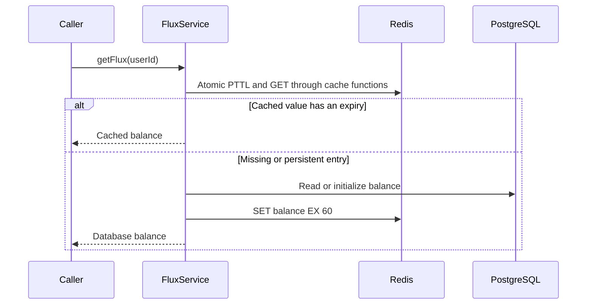

# Redis cache functions and Flux balance expiry

Status: accepted

## Decision

Every write to `user:{userId}:flux` uses `SET EX 60`.
The value and expiry change atomically. Cache hits do not renew the expiry.
Readers accept only entries with an expiry. Persistent entries reload from PostgreSQL and receive the same TTL.
PostgreSQL remains the balance and ledger authority.

Sixty seconds limits stale balance exposure after failed invalidation or reordered cache writes while retaining a short read cache.
Each Flux read uses one Lua call to inspect the value and expiry atomically.
Malformed balance snapshots reload from PostgreSQL.
A concurrent write can still replace a newer balance. Expiry bounds each cached snapshot's lifetime but does not serialize database and cache writes.

## Ownership

Stateless functions in `libs/redis/cache.ts` own expiring Redis reads and atomic writes with a required positive TTL.
They propagate errors and do not own connections, retries, database reads, or billing rules.
Domain functions in `services/domain/flux-cache.ts` own the balance format and 60-second TTL.
Existing services keep their error handling and transaction boundaries. No new service or dependency injection registration is needed.
ConfigKV shares the write function and retains its existing read and error behavior.

## Scope

Balance initialization, database cache fills, debit, credit, and payment cache synchronization share the TTL.
Admin overrides and account deletion retain their existing cache invalidation.
Untouched persistent keys remain until a balance read or mutation replaces them. No production key scan runs in this change.

## Non-goals

No ledger changes, debt-meter expiry changes, distributed locking, or production data operations.

## Module dependencies



## Affected files

```text
server/apps/api/src/
  libs/redis/cache.ts
  libs/redis/cache.test.ts
  services/adapters/config-kv/store.ts
  services/domain/
    flux-cache.ts
    flux.ts
    flux.test.ts
    billing/
      billing-service.ts
      tests/billing-service.test.ts
```

## Read sequence



## Verification

Use the existing PGlite and Redis test boundary.
Verify expiring initialization, database reload, debit, credit, and payment synchronization.
Advance the test clock to verify that cache hits do not renew expiry and expired balances reload without another initial grant.
Verify that a persistent cached balance reloads from PostgreSQL.

## Redis key names

Keys identify the owning domain without a `cache:` prefix.
ConfigKV uses `config:{key}`. Stripe prices use `stripe:prices`.
Flux keeps `user:{userId}:flux`. TTLs remain unchanged.
New instances fill the new keys on demand. Existing expiring keys expire naturally.
During a rolling deployment, old and new instances use separate ConfigKV and Stripe keys.
Invalidation reaches only the caller's namespace, so the other namespace can remain stale until its existing 300-second TTL expires.
No key scan, deletion job, or fallback to the old names is added.
