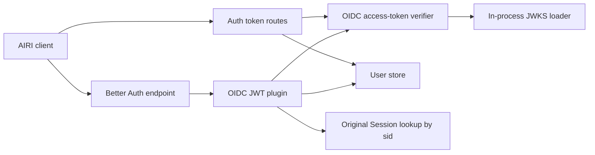
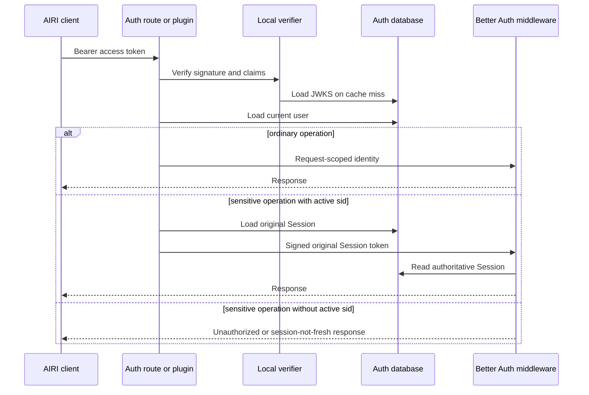

# OIDC JWT identity at the Better Auth boundary

Status: accepted

## Context

The Auth service issues OIDC access tokens for AIRI clients. These clients also
call Better Auth profile and account endpoints with the access token.

Better Auth session middleware accepts its session cookie format. It does not
accept the asymmetric JWT access tokens from the OAuth Provider plugin.

The existing bridge verifies each JWT and creates a database Session. It then
injects the new Session token as a request cookie. Client session polling can
therefore create one database row per request. PostgreSQL does not remove rows
when `expires_at` passes.

The custom `/get-session` and `/list-sessions` routes also call Better Auth
before their direct JWT verifier. This order invokes the bridge on the hottest
authentication path. Their verifier also fetches this service's public JWKS
endpoint over loopback HTTP.

## Decision

Use one local access-token verifier for Auth routes and the Better Auth plugin.
The verifier loads JWKS data in-process and caches the key set for 60 seconds.
It validates the verified JWT claims with Valibot.

Apply the change in two stacked pull requests:

1. The custom token routes validate the JWT before Better Auth session lookup.
2. The plugin supplies verified identity through the request context. It does
   not create a Session row.

The final plugin treats the JWT as the credential for ordinary operations. If
the token contains an active original `sid`, the plugin supplies that Session
token to Better Auth's authoritative middleware. Sensitive and fresh-session
operations require this active Session.

The OAuth Provider includes `sid` in access tokens created from an active login
Session. A refreshed token can omit `sid` after that Session expires or is
deleted. Such a token remains valid for ordinary operations until `exp`, but it
cannot authorize a sensitive operation.

## Scope

- Auth service OIDC access-token validation
- Custom Auth token routes
- Better Auth request identity
- Better Auth sensitive-session behavior
- Account-ban checks for JWT callers

## Non-goals

- Delete historical expired Session rows
- Change access-token or refresh-token lifetimes
- Change OAuth Provider database tables
- Replace Better Auth or its OAuth Provider plugin
- Change resource API authentication

## Consequences

- Normal JWT requests do not create Session rows.
- JWT verification does not call the service over loopback HTTP.
- Key rotation reaches each verifier within 60 seconds.
- Ordinary JWT requests still load the current user for deletion and ban state.
- Sensitive operations retain Session revocation and freshness checks.
- Existing expired rows require a separate production cleanup plan.

## Module dependencies



## Affected files

```text
server/
  apps/auth/src/
    auth.ts
    oidc-access-token.ts
    routes.ts
    plugins/oidc-jwt-bearer.ts
    tests/
      oidc-jwt-bearer.test.ts
      routes-oidc-token-auth.test.ts
  docs/ai/adr/
    2026-09-20-oidc-jwt-session-boundary.md
```

## Request sequence



## Test plan

- Make sure that valid JWT routes do not call Better Auth session lookup.
- Make sure that invalid JWTs retain the Better Auth fallback.
- Make sure that invalid claims do not create request identity.
- Make sure that the plugin never calls `createSession`.
- Make sure that an active `sid` supplies the original Session cookie.
- Make sure that an expired `sid` cannot supply the Session cookie.
- Make sure that banned users do not receive request identity.
- Run Auth tests, Auth typecheck, repository lint, and CI.
